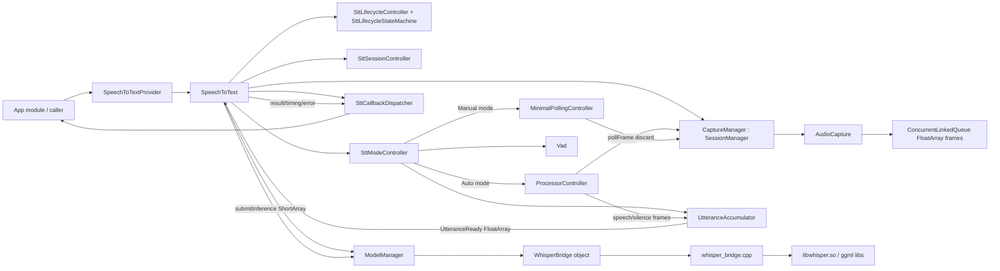
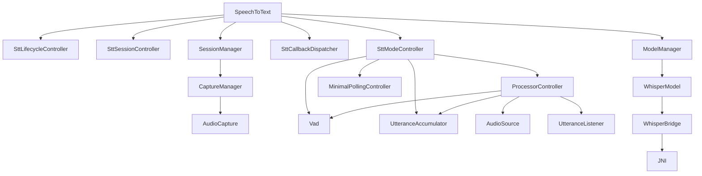
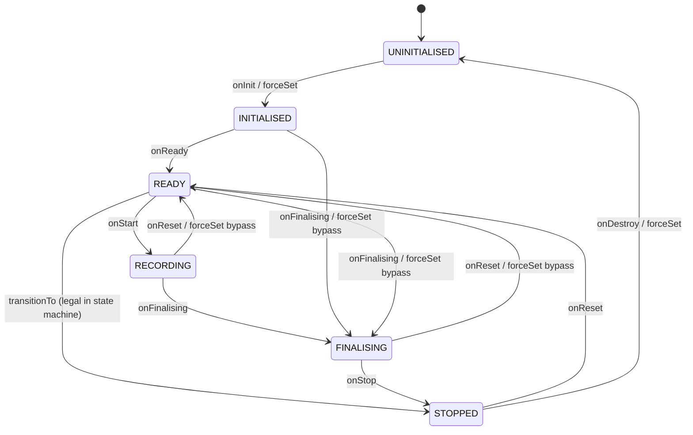
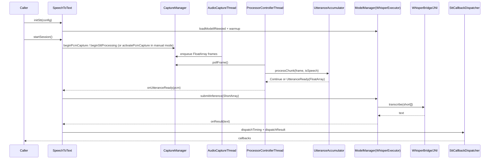
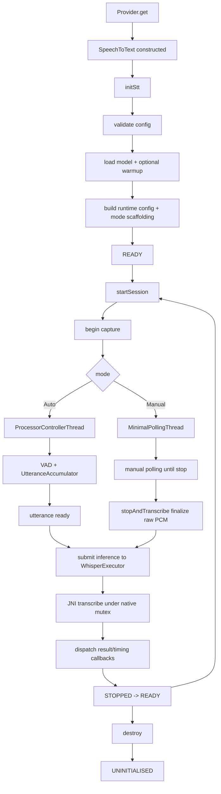

# STT Module Architecture Map

## 1) Scope and intent

This document maps the full architecture of the `stt` module in this repository, based on current source code under:

- `stt/src/main/java/dev/barrycade/voicecore/stt`
- `stt/src/main/cpp`
- `stt/build.gradle.kts` (API surface constraints and native wiring)

Primary runtime pipeline:

- PCM capture -> queue/drain/session buffer -> VAD -> utterance accumulator -> Whisper JNI -> transcript callbacks

Public API entrypoints are intentionally constrained by `checkSttApiSurface` in `stt/build.gradle.kts`.

## 2) High-level module structure

## 3) Complete type inventory

### 3.1 Orchestrators and controllers

- `SpeechToText` (main orchestrator)
- `SpeechToTextProvider` (singleton provider)
- `SttLifecycleController` (lifecycle policy)
- `SttLifecycleStateMachine` (thread-safe transition enforcement)
- `SttSessionController` (session and timing state)
- `SttModeController` (manual/auto mode selection and controller assembly)
- `ProcessorController` (auto-mode frame polling, VAD, accumulator loop)
- `MinimalPollingController` (manual-mode queue drain poller)
- `CaptureManager` (session PCM buffering and drain handoff)
- `ModelManager` (Whisper model lifecycle + inference executor)
- `SttCallbackDispatcher` (result/timing/error dispatch)
- `SttThreadController` (generic thread manager utility; currently instantiated but not actively wired in runtime path)

### 3.2 Audio and processing contracts

- `AudioCapture`
- `AudioSource` (interface)
- `SessionManager` (interface, extends `AudioSource`)
- `PollingController` (interface)
- `UtteranceAccumulator`
- `UtteranceListener` (interface)
- `FrameResult` (sealed: `Continue`, `UtteranceReady`)
- `Vad`
- `RmsSampler`

### 3.3 Strategy and event model

- `StartStrategy` (interface)
- `ManualStart`
- `VadStartConfig`, `VadStart`
- `WakeWordConfig`, `WakeWordStart`
- `StopStrategy` (interface)
- `ManualStop`
- `AutoSilenceConfig`, `AutoSilenceStop`
- `DurationStop`
- `SttEvents` and nested `EventFlag`

### 3.4 Configuration model

- `SttRunConfig`
- `StartStrategyConfig`
- `StopStrategyConfig`
- `VadConfig`
- `TtsEngineConfig`
- `RuntimeSttConfig` (+ `fromSttRunConfig`, `validate` extension)
- `DrainMode`
- `SttRunConfigValidator`

### 3.5 Lifecycle, results, errors

- `SttLifecycleState` (sealed states)
- `SessionResult`
- `SttReturnCode`
- `ReturnCodeMapper` (present, currently not on main runtime path)
- `SttTimingSnapshot`
- `SttError`
- `SttErrorCode`
- `SttErrorCategory`
- `SttErrorListener`
- `SttReadyListener` (present; `ModelManager` supports it)

### 3.6 Native bridge and C++ runtime

- `WhisperModel` (interface)
- `WhisperBridge` (object implementing `WhisperModel`, external JNI methods)
- `whisper_bridge.cpp` (JNI implementations + global mutex/context)
- `CMakeLists.txt` (links `whisper_bridge` against prebuilt `libwhisper.so`)
- Prebuilt JNI libs in `stt/src/main/jniLibs/arm64-v8a`

## 4) Responsibilities and dependencies

### 4.1 Core control-plane responsibilities

- `SpeechToText`
  - Owns overall lifecycle API: `setConfig`, `initStt`, `startSession`, `stopAndTranscribe`, `resetForNextSession`, `destroy`.
  - Wires and coordinates all controllers/managers.
  - Converts PCM `FloatArray` to `ShortArray` for inference submission.
  - Enforces high-level state gating with `stateLock`, `AtomicBoolean` flags, and lifecycle checks.

- `SpeechToTextProvider`
  - Double-checked-locking singleton creation.
  - Owns test-only reset path.

- `SttLifecycleController` + `SttLifecycleStateMachine`
  - Legal transition policy and transition execution.
  - Supports controlled bypass via `forceSet` for specific paths (init/finalizing/reset/destroy bypasses).

- `SttSessionController`
  - Tracks timing markers: session start/end, inference start/end, PCM capture timing, utterance timing.

- `SttModeController`
  - Builds mode-specific processing stack from `RuntimeSttConfig`.
  - Auto mode: constructs `Vad`, `UtteranceAccumulator`, `ProcessorController`.
  - Manual mode: constructs `MinimalPollingController`.

### 4.2 Data-plane responsibilities

- `CaptureManager`
  - Owns microphone queue ingestion and session-level raw PCM accumulation.
  - Manages drain behavior (`DRAIN_FROM_HEAD` vs `DRAIN_FROM_NEXT_FRAME`).
  - Finalizes raw session PCM on stop.

- `AudioCapture`
  - Owns `AudioRecord` lifecycle and dedicated capture worker thread.
  - Converts short PCM reads into normalized float frames, enqueues to lock-free queue.

- `ProcessorController`
  - Polls frames, invokes VAD, updates RMS diagnostics, feeds accumulator.
  - Emits complete utterances to `UtteranceListener`.

- `UtteranceAccumulator`
  - Handles utterance boundary semantics (pre-roll, speech start, silence timeout, max duration).
  - Produces `FrameResult.UtteranceReady` when boundaries are met.

- `Vad`
  - RMS-energy based speech detection with hysteresis and confidence diagnostics.

- `ModelManager`
  - Owns model load/unload and serialized inference dispatch on dedicated single-thread executor.
  - Bridges to `WhisperModel` (`WhisperBridge` in production).

- `WhisperBridge` + JNI
  - Loads native libs and delegates to JNI externals.
  - C++ side holds global `whisper_context` guarded by `std::mutex`.

### 4.3 Dependency graph (logical)

## 5) Lifecycle model

### 5.1 System lifecycle states

### 5.2 External API lifecycle phases

1. `SpeechToTextProvider.get(context)` constructs singleton instance if absent.
2. `setConfig(config)` validates config and stores active `SttRunConfig`.
3. `initStt(config)` validates config, loads model, optional warmup, builds runtime config and mode-specific controllers.
4. `startSession()` checks lifecycle/model/config gates, starts capture/process path by mode.
5. `stopAndTranscribe()` finalizes PCM, submits inference, transitions STOPPED -> READY.
6. `resetForNextSession()` resets controllers/session/capture and lifecycle back to READY.
7. `destroy()` stops controllers, shuts down capture + model executor, clears listeners, transitions UNINITIALISED.

## 6) State transitions in runtime control flow

### 6.1 Session start path

- Preconditions:
  - `runConfig != null`
  - initialized state is READY/INITIALISED
  - `modelManager.isReady == true`
- Transition sequence:
  - `events.manualStartPressed.raise()`
  - `config.startStrategy.shouldStart(events, activeVad)`
  - if true: begin session timing + capture setup
  - if auto mode: start processor -> `onStart()` to RECORDING
  - if manual mode: activate capture + minimal polling thread

### 6.2 Session stop path

- Trigger: `stopAndTranscribe()`
- Transition sequence:
  - `events.manualStopPressed.raise()` and `stopStrategy.shouldStop(...)`
  - `isRunning=false`, `stopRequested=true`
  - stop controller and finalize PCM via `CaptureManager.finalize()`
  - empty PCM: `onStop()` then `onReset()`
  - non-empty PCM: `onFinalising()` -> submit inference -> `onStop()` -> `onReset()`

## 7) Concurrency boundaries and thread model

### 7.1 Threads and executors

- Caller thread
  - Invokes public lifecycle API methods on `SpeechToText`.

- `AudioCaptureThread`
  - Created by `AudioCapture.start()`.
  - Reads `AudioRecord`, writes `FloatArray` frames to queue.

- `CaptureManagerDrain` thread
  - Created by `CaptureManager.beginSttProcessing()` depending on drain mode.
  - Moves queued frames into session buffer until processor handoff/stop.

- `ProcessorControllerThread`
  - Auto mode polling loop: consumes frames, VAD, accumulator, utterance events.

- `MinimalPollingThread`
  - Manual mode queue drainer (no VAD/accumulator), prevents queue growth.

- `WhisperExecutor`
  - Single-thread `ExecutorService` in `ModelManager`.
  - Serializes inference tasks and (legacy-capable) async init tasks.

- Native critical section (`whisper_bridge.cpp`)
  - `std::mutex g_mutex` serializes `loadModel`, `transcribe`, and `unloadModel` access to global `g_ctx`.

### 7.2 Synchronization primitives and ownership

- `SpeechToText`: `stateLock`, `AtomicBoolean isRunning`, `AtomicBoolean isInferencing`, volatile `stopRequested`.
- `SttLifecycleStateMachine`: internal lock + volatile current state.
- `CaptureManager`: volatile `draining`, volatile `sttActive`; queue is `ConcurrentLinkedQueue`.
- `AudioCapture`: internal `stateLock` + volatile running flag.
- `ProcessorController`: `AtomicBoolean isRunning`, volatile metrics fields.
- `SttEvents.EventFlag`: `AtomicBoolean` one-shot events.
- `ModelManager`: single-thread executor + volatile `isReady`/`initFailed`.

### 7.3 Concurrency boundaries

- Boundary A: microphone capture boundary
  - `AudioCaptureThread` produces frames to queue.
- Boundary B: queue draining / polling boundary
  - `CaptureManagerDrain` or processor/minimal polling thread consumes queue.
- Boundary C: inference boundary
  - `SpeechToText` submits `ShortArray` to `ModelManager` executor.
- Boundary D: native boundary
  - JNI call enters C++ and acquires global mutex around Whisper context operations.
- Boundary E: callback boundary
  - result/timing callbacks are invoked on whisper executor thread;
  - error callbacks are invoked on the thread encountering the error.

## 8) End-to-end data flow

### 8.1 Primary data path

### 8.2 Mode-dependent flow differences

- Auto mode (`ProcessorController`)
  - Uses VAD + accumulator and emits utterance-ready chunks.
- Manual mode (`MinimalPollingController`)
  - No VAD/accumulator; stop path uses `CaptureManager.finalize()` raw PCM.

## 9) Error propagation map

### 9.1 Sources and propagation channels

- `AudioCapture`
  - Throws `IllegalStateException` on invalid AudioRecord setup/start.
  - Propagation: bubbles through caller path (not automatically converted to `SttError` in `AudioCapture` itself).

- `ModelManager`
  - Load/init failures set `initFailed` and may emit `SttError(MODEL_LOAD_FAILED)` via injected `SttErrorListener`.
  - Inference failures in `submitInference` are logged and task returns without callback text.

- `SpeechToText.startProcessor`
  - Dispatches generic runtime errors via `SttCallbackDispatcher.dispatchError` for model-not-ready test/failure paths.

- `UtteranceAccumulator` (force-timeout test hook)
  - Emits `SttError(PIPELINE_ILLEGAL_STATE)` through `sttErrorListener` then finalizes utterance.

- `SttLifecycleStateMachine`
  - Illegal transition logs lifecycle error, returns false.

### 9.2 Dispatch behavior

- `SttCallbackDispatcher.dispatchError(Throwable)`
  - Sends throwable to generic `onError` listener.
  - Also wraps into structured `SttError(INTERNAL_EXCEPTION)` for `SttErrorListener`.

- Result/timing callbacks
  - Dispatched on whisper executor thread.

## 10) Configuration injection points

### 10.1 External config ingress

- `SpeechToText.setConfig(SttRunConfig)`
  - Validates through `SttRunConfigValidator`.
  - Stores `runConfig` and `DrainMode`.

- `SpeechToText.initStt(SttRunConfig)`
  - Re-validates config, updates model path, builds `RuntimeSttConfig` from strategy/value config.

### 10.2 Runtime config transformation

- `RuntimeSttConfig.fromSttRunConfig` converts declarative strategy configs to concrete strategy instances:
  - `StartStrategyConfig` -> `ManualStart` / `VadStart` / `WakeWordStart`
  - `StopStrategyConfig` -> `ManualStop` / `AutoSilenceStop` / `DurationStop`

### 10.3 Constructor-level dependency injection

- `SpeechToText` constructor supports injected test doubles:
  - `whisperModel: WhisperModel` (defaults to `WhisperBridge`)
  - `captureManager: SessionManager` (defaults to `CaptureManager`)

- `ModelManager` constructor supports:
  - injected `WhisperModel`
  - optional `SttErrorListener` and `SttReadyListener`

### 10.4 Build/native injection points

- `stt/build.gradle.kts`
  - CMake enabled and ABI restricted to `arm64-v8a`.
- `stt/src/main/cpp/CMakeLists.txt`
  - Binds JNI shim to prebuilt `libwhisper.so` and log library.

## 11) API surface governance

`checkSttApiSurface` in `stt/build.gradle.kts` enforces allowed public top-level types and key JNI signatures in `WhisperBridge.kt`.

Implication:

- Architecture intentionally keeps implementation classes `internal` and stable API narrow.

## 12) Runtime lifecycle summary (control + data + concurrency)

## 13) Notes on active vs auxiliary paths

- Active runtime path is centered on `SpeechToText` + `CaptureManager` + mode-specific controller + `ModelManager`.
- Present but not central in current path:
  - `SttThreadController` is created in `SpeechToText` but not used for thread orchestration.
  - `ReturnCodeMapper` exists for legacy/new code mapping but is not on the main path shown in `SpeechToText` runtime flow.
  - `ModelManager.initAsync` and `setReadyListener` exist; current `initStt` path uses synchronous `loadModelIfNeeded` + optional warmup.

This concludes the complete architectural map for the current STT module implementation.
