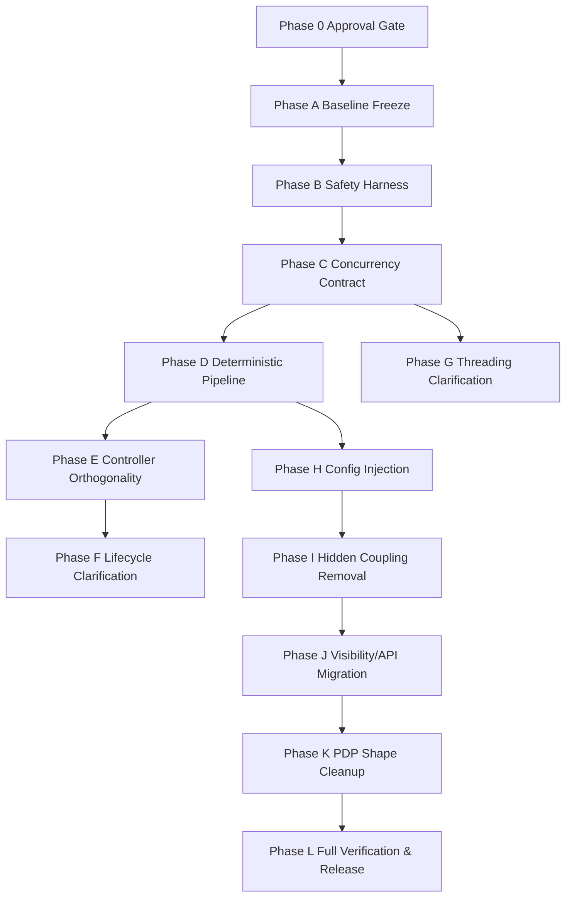

# STT Unified Refactor Roadmap

## 1) Purpose

This roadmap merges and supersedes planning content from:

- [stt/ARCHITECTURE_MAP.md](stt/ARCHITECTURE_MAP.md)
- [stt/CONCURRENCY_AUDIT_REPORT.md](stt/CONCURRENCY_AUDIT_REPORT.md)
- [stt/VISIBILITY_REFACTOR_PLAN.md](stt/VISIBILITY_REFACTOR_PLAN.md)
- [stt/PDP_REFACTOR_PLAN.md](stt/PDP_REFACTOR_PLAN.md)

It defines dependency-ordered execution, blockers, sequencing, compatibility strategy, test matrix, risk mitigation, and Mini-PDP alignment.

Constraint:

- No Phase 1 implementation begins until this roadmap is approved.

## 2) Unified outcomes

1. Deterministic, explicit STT runtime pipeline.
2. Orthogonal controllers with single-responsibility ownership.
3. Explicit lifecycle transitions with one authority.
4. Explicit immutable configuration injection at session boundaries.
5. Concurrency safety and warm-start correctness.
6. Visibility/API surface reduction with compatibility-preserving migration.
7. Mini-PDP structural compliance in touched Kotlin code.

## 3) Dependency-resolved execution model

Execution rule:

- A phase can start only when all predecessor phases are complete and its blockers are cleared.

## 4) Cross-phase dependencies and blockers

## 4.1 Dependency table

1. Phase A Baseline Freeze

- Depends on: Approval Gate
- Unblocks: all implementation phases

1. Phase B Safety Harness

- Depends on: Phase A
- Unblocks: Concurrency Contract, Pipeline, Lifecycle work

1. Phase C Concurrency Contract

- Depends on: Phase B
- Unblocks: Deterministic Pipeline, Threading Clarification, Hidden Coupling removal

1. Phase D Deterministic Pipeline

- Depends on: Phase C
- Unblocks: Controller Orthogonality, Config Injection

1. Phase E Controller Orthogonality

- Depends on: Phase D
- Unblocks: Hidden Coupling removal

1. Phase F Lifecycle Clarification

- Depends on: Phase D
- Unblocks: Verification matrix lifecycle assertions

1. Phase G Threading Clarification

- Depends on: Phase C
- Unblocks: Risk closure for deadlock/warm-start issues

1. Phase H Config Injection

- Depends on: Phase D
- Unblocks: API migration and deterministic behavior guarantees

1. Phase I Hidden Coupling Removal

- Depends on: Phases E, H
- Unblocks: Visibility/API reduction with confidence

1. Phase J Visibility/API Migration

- Depends on: Phase I
- Unblocks: rollout and compatibility finalization

1. Phase K PDP Shape Cleanup

- Depends on: Phase J
- Unblocks: final sign-off on structural compliance

1. Phase L Full Verification & Release

- Depends on: Phases F, G, K
- Final release gate

## 4.2 Blocker register

1. API policy inconsistency

- Symptoms:
  - [stt/VISIBILITY_REFACTOR_PLAN.md](stt/VISIBILITY_REFACTOR_PLAN.md) defines one target public surface.
  - Build checks and existing docs may enforce different expectations.
- Impact: blocks Phase J final API lock.
- Resolution: ADR decision on final public API list before Phase J starts.

1. App-level coupling to broad STT API

- Evidence in app imports noted in [stt/VISIBILITY_REFACTOR_PLAN.md](stt/VISIBILITY_REFACTOR_PLAN.md).
- Impact: blocks removal/internalization steps.
- Resolution: migration adapters and staged deprecation window.

1. Missing stress-test harness for concurrency hazards

- Evidence from [stt/CONCURRENCY_AUDIT_REPORT.md](stt/CONCURRENCY_AUDIT_REPORT.md).
- Impact: blocks confidence on Phases C, D, G.
- Resolution: add deterministic stress suite in Phase B.

1. Hidden ownership of mutable state across controllers

- Impact: blocks orthogonality and deterministic pipeline guarantees.
- Resolution: ownership map and single-write-site enforcement in Phases E and I.

## 5) Sequencing and step-by-step plan

## Phase 0: Approval Gate (no code changes)

1. Review this roadmap for acceptance.
2. Confirm final target public API policy for Phase J.
3. Confirm compatibility window length (N releases).

Exit criteria:

- Approved roadmap.
- Documented API policy decision.
- Explicit authorization to start Phase A.

## Phase A: Baseline Freeze

1. Freeze current behavior with regression tests.
2. Snapshot current architecture and lifecycle trace logs.
3. Define measurable invariants for pipeline determinism.

Exit criteria:

- Stable baseline test run repeated multiple times.

## Phase B: Safety Harness

1. Add concurrency stress harness:

- rapid start-stop loops
- stop-reset races
- destroy during callback windows
- overlapping inference completion windows

1. Add lifecycle legality assertions and transition table tests.

Exit criteria:

- Harness produces reproducible results and catches known issues.

## Phase C: Concurrency Contract

1. Introduce single lifecycle serialization policy in orchestrator.
2. Add session epoch gating and stale callback rejection.
3. Correct inference in-flight state semantics.
4. Add self-join prevention in worker stop paths.

Exit criteria:

- Known high-severity concurrency findings from audit are closed or downgraded with evidence.

## Phase D: Deterministic Pipeline

1. Introduce explicit stage model:

- Capture -> Process -> Finalize -> Infer -> Dispatch

1. Enforce single entry/exit per stage.
2. Ensure READY transition occurs only on explicit completion path.

Exit criteria:

- Pipeline trace is linear and deterministic in stress tests.

## Phase E: Controller Orthogonality

1. Refactor ownership boundaries:

- lifecycle controller handles lifecycle only
- session controller handles timing/session ids only
- inference controller handles inference adaptation only

1. Remove sideways responsibility leakage.

Exit criteria:

- Each controller has one bounded concern with explicit dependencies.

## Phase F: Lifecycle Clarification

1. Consolidate transition intents.
2. Restrict bypass transitions to teardown-only documented exceptions.
3. Align code and tests with single transition authority.

Exit criteria:

- Transition matrix fully tested for legal and illegal edges.

## Phase G: Threading Clarification

1. Document thread ownership per subsystem.
2. Move blocking operations out of broad lock scopes where safe.
3. Add thread-affinity assertions at key boundaries.

Exit criteria:

- No unresolved lock-order or warm-start race concerns in audit re-run.

## Phase H: Explicit Configuration Injection

1. Build immutable session config snapshot at start.
2. Inject by constructor/explicit method into all session-scoped components.
3. Remove mutable config reads on worker threads.

Exit criteria:

- Worker paths use only immutable per-session config.

## Phase I: Hidden Coupling Removal

1. Remove callback-pointer coupling between controllers.
2. Enforce one owner and one write site for mutable fields.
3. Replace implicit cross-controller flags with explicit command interfaces.

Exit criteria:

- Shared-state ownership map has no ambiguous fields.

## Phase J: Visibility/API Migration

1. Apply compatibility-preserving API migration steps.
2. Tighten public API checks to approved policy.
3. Keep test doubles preserved and documented.

Exit criteria:

- API compatibility tests pass for transition release.
- Deprecated path coverage is in place.

## Phase K: Mini-PDP Structural Cleanup

1. Flatten nested conditionals and nested lambdas in touched files.
2. Make action order linear: construct -> configure -> start.
3. Ensure explicit return/parameter types at internal/public boundaries.
4. Remove hidden behavior in scope functions and callback setup.

Exit criteria:

- Mini-PDP checklist satisfied for all changed Kotlin files.

## Phase L: Full Verification and Release

1. Re-run full test matrix.
2. Re-run concurrency audit checks against updated code.
3. Verify compatibility and migration artifacts.
4. Produce release notes and rollback plan.

Exit criteria:

- Release candidate approved.

## 6) Compatibility strategy

## 6.1 Release tracks

1. Track R1 (compatibility release)

- Keep legacy APIs with deprecation markers.
- Add adapters to new deterministic internals.
- No breaking API removals.

1. Track R2 (migration enforcement)

- Tighten warnings and migration checks.
- Maintain runtime behavior parity.

1. Track R3 (cleanup release)

- Remove deprecated legacy surfaces per approved policy.

## 6.2 Compatibility principles

1. Behavior compatibility first

- No semantic drift in transcript/timing/error delivery unless explicitly approved.

1. Binary and source compatibility during window

- Legacy constructors/types remain callable through adapters.

1. Test-double continuity

- Preserve constructor injection seams used by stt tests.

## 7) Unified test matrix

## 7.1 Determinism and lifecycle

1. Lifecycle legality tests

- all legal transitions
- all illegal transitions

1. Stage progression tests

- deterministic stage order
- no skipped transitions

## 7.2 Concurrency and warm-start

1. Rapid start-stop loops
2. stop-reset overlaps
3. destroy while callbacks execute
4. inference callback after new session start
5. self-join regression tests

## 7.3 Visibility/API compatibility

1. Public API smoke tests for approved surface
2. Deprecated adapter behavior tests
3. App module integration compile tests

## 7.4 PDP structural compliance

1. Guard-clause checks in lifecycle methods
2. No nested-scope-function patterns in touched code
3. One-write-site checks for mutable fields (manual review checklist)

## 8) Risk mitigation plan

1. Risk: regression in transcript behavior

- Mitigation: golden transcript/timing regression tests.
- Fallback: feature flag to route through previous path for one release.

1. Risk: deadlocks or stalls introduced by locking changes

- Mitigation: lock scope minimization + stress harness.
- Fallback: rollback to previous lock strategy branch.

1. Risk: API migration breakage

- Mitigation: compatibility adapters + compile-time smoke checks in app.
- Fallback: retain deprecated path one extra release.

1. Risk: hidden coupling reintroduced during refactor

- Mitigation: ownership map and mandatory review checklist per PR.
- Fallback: block merge until ownership violations are resolved.

1. Risk: Mini-PDP drift in follow-up edits

- Mitigation: PDP checklist in PR template and code review gate.

## 9) Mini-PDP alignment checklist (release gate)

Derived from [.continue/rules/mini-pdp.md](.continue/rules/mini-pdp.md):

1. No nested lambdas unless unavoidable.
2. No nested scope functions.
3. No ambiguous trailing lambda calls inside lambdas.
4. Linear initialization order: construct -> configure -> start.
5. One action per line in orchestration code.
6. Explicit API boundary types and return types.
7. Guard clauses over nested conditionals.
8. Early returns over mutable result accumulation.
9. One write site per mutable field, except documented concurrency exceptions.

This checklist must pass before Phase L release approval.

## 10) Governance and change control

1. Each phase runs as a separate PR series.
2. Each phase requires:

- dependency check
- blocker check
- test-matrix delta report
- risk log update

1. Phase transition requires explicit sign-off recorded in this file.

## 11) Phase start policy

Implementation policy:

- Phase 1 implementation remains blocked.
- Work starts only after roadmap approval is explicitly granted.
