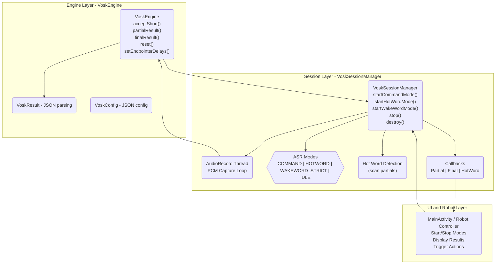

# **ASR Subsystem Architecture**

A structured overview of how speech recognition is implemented in the Jenkins robot, including engine abstraction, session control, mode semantics, and power behaviour.

---

## **1. Layer Overview**

The ASR subsystem is built as a **three‑layer architecture**, separating raw recognition from session logic and robot behaviour.

### **Layer 1 — Engine Layer (VoskEngine)**

Responsible for:

- Feeding PCM audio into Vosk  
- Retrieving partial and final results  
- Applying endpointing delays  
- Managing recognizer lifecycle  

This layer is a **thin wrapper** around the official Vosk Java API.

### **Layer 2 — Session Layer (VoskSessionManager)**

Responsible for:

- AudioRecord thread  
- Buffer management  
- Mode switching  
- Wake‑word / hot‑word detection  
- Command lifecycle  
- Power behaviour  
- Callbacks to the UI  

This layer defines the robot’s **actual behaviour**.

### **Layer 3 — UI / Robot Layer**

Responsible for:

- Starting/stopping modes  
- Displaying partial/final results  
- Triggering robot actions  
- Managing user interaction  

This layer interacts only with the SessionManager.

---

## **2. Engine Layer**

### **VoskEngine**

A minimal abstraction over `org.vosk.Recognizer`.

Responsibilities:

- `acceptShort()` — feed PCM  
- `partialResult()` — get streaming partial JSON  
- `finalResult()` — get final JSON  
- `setEndpointerDelays()` — configure endpoint timing  
- `reset()` — clear recognizer state  

This layer contains **no threading**, **no modes**, and **no wake‑word logic**.

---

## **3. Session Layer**

### **VoskSessionManager**

This is the core of the ASR subsystem.

Responsibilities:

- Owns the AudioRecord capture thread  
- Runs the PCM → Vosk loop  
- Implements all ASR modes  
- Detects hot‑word inside partials  
- Switches between modes  
- Manages recognizer lifecycle  
- Delivers callbacks to the UI  

### **Public API**

- `startCommandMode()`  
- `startHotWordMode()`  
- `startWakeWordMode()` *(strict mode — placeholder)*  
- `stop()`  
- `destroy()`  

### **Callbacks**

- `VoskPartialListener`  
- `VoskFinalListener`  
- `VoskHotWordListener`  

These are fun interfaces for easy lambda usage.

---

## **4. Mode Semantics**

The SessionManager implements three distinct ASR modes.

### **4.1 Command Mode**

- One‑shot utterance  
- Silence‑based endpointing  
- Full transcription  
- Stops automatically after final result  
- High‑power mode  
- Must be manually started  

Used for explicit commands.

---

### **4.2 Hot Word Mode**

- Continuous listening  
- Full transcription  
- Detects trigger word anywhere in the utterance  
- On trigger → switches into Command Mode  
- After command → returns to Hot Word Mode  
- High‑power mode  
- Must be manually started  

Used for conversational robot interaction.

---

### **4.3 Wake Word Mode (Strict)**

*(Not yet implemented)*

- Low‑power wake‑word detection  
- No full ASR  
- Works while device sleeps  
- On wake‑word → starts Command Mode  
- After command → returns to wake‑word listening  

Used for “always listening” behaviour.

---

## **5. Power Model**

### **High‑Power Modes**

- Command Mode  
- Hot Word Mode  

These run full ASR and must be manually started/stopped.

### **Low‑Power Mode**

- Wake Word Mode (Strict)

This mode uses a lightweight wake‑word engine and can run indefinitely.

---

## **6. Responsibilities Summary**

### **VoskEngine**

- ASR only  
- No modes  
- No wake‑word  
- No threading  
- No power logic  

### **VoskSessionManager**

- All modes  
- All wake‑word/hot‑word detection  
- All threading  
- All power behaviour  
- All session lifecycle  

### **UI / Robot**

- Starts/stops modes  
- Displays results  
- Executes robot actions  

---

## **7. Design Principles**

The subsystem follows established ASR architecture patterns:

- **Engine Wrapper Pattern**  
- **Session Manager Pattern**  
- **Mode‑Driven State Machine Pattern**  
- **Callback Interface Pattern**  
- **Manual High‑Power Mode Pattern**  
- **Low‑Power Wake‑Word Frontend Pattern**  
- **Recognizer Isolation Pattern**  

These patterns match the architectures used by Alexa, Siri, Google Assistant, Mycroft, and commercial robotics platforms.

---

## **8. Future Work**

- Implement strict Wake Word Mode  
- Add low‑power DSP wake‑word engine  
- Add automatic fallback to wake‑word mode after command  
- Add per‑mode CPU/power telemetry  
- Add noise‑robust wake‑word training for “Jenkins”  

---

